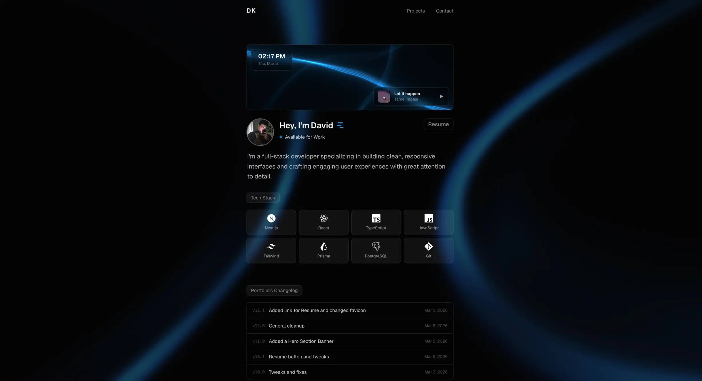

# DK — Portfolio

Personal portfolio website built with Next.js 16, TypeScript, and Tailwind CSS v4.

**Live:** [davidk.vercel.app](https://davidk.vercel.app)
---
[](https://davidk.vercel.app)

---

## Stack

- **Framework** — Next.js 16 (App Router)
- **Language** — TypeScript
- **Styling** — Tailwind CSS v4
- **Animations** — Framer Motion
- **Background** — Three.js (WebGL shader via ColorBends)
- **Email** — EmailJS
- **Map** — Leaflet + Mapbox
- **Icons** — Simple Icons, Lucide React
- **Fonts** — Geist (via next/font)
- **Deployment** — Vercel

---

## Features

- Animated WebGL background with mouse parallax
- Persistent audio player across pages
- Hero banner with live local clock and FloatingLines WebGL animation
- Expandable project cards with live iframe previews
- Portfolio changelog widget (fed via Clivy RSS)
- EmailJS contact form
- Mapbox dark map with animation and live clock
- Transitions with Framer Motion
- Fully responsive — mobile optimized throughout

---

## Project Structure

```
src/
├── app/
│   ├── page.tsx              # Home
│   ├── projects/page.tsx     # Projects
│   ├── contact/page.tsx      # Contact
│   ├── layout.tsx            # Root layout with AudioProvider
│   └── globals.css
├── components/
│   ├── Hero.tsx              # Hero banner, clock, music player
│   ├── Navbar.tsx            # Fixed navbar with scroll blur
│   ├── ProjectsSection.tsx   # Homepage project rows
│   ├── ProjectCard.tsx       # Expandable project cards
│   ├── ChangelogWidget.tsx   # Clivy RSS changelog
│   ├── CTA.tsx               # Email copy button
│   ├── Footer.tsx
│   ├── ContactMap.tsx        # Leaflet + Mapbox map
│   ├── ColorBends.tsx        # WebGL background
│   ├── FloatingLines.tsx     # WebGL hero banner lines
│   ├── AnimatedLayout.tsx    # Page transition wrapper
│   └── PageTransition.tsx
└── context/
    └── AudioContext.tsx      # Persistent audio across navigation
```

---

## Getting Started

```bash
npm install
npm run dev
```

Open [http://localhost:3000](http://localhost:3000).

### Environment Variables

Create a `.env.local` file:

```env
NEXT_PUBLIC_MAPBOX_TOKEN=your_mapbox_token
```

EmailJS credentials are defined directly in `src/app/contact/page.tsx`.

---

## Projects Featured

| Project                                             | Description                        | Stack                               |
| --------------------------------------------------- | ---------------------------------- | ----------------------------------- |
| [Clivy](https://clivy-one.vercel.app)               | Changelog & release notes platform | Next.js, PostgreSQL, Prisma, Resend |
| [Sine Fere](https://clothing-store-neon.vercel.app) | E-commerce clothing store          | Next.js, Stripe, Framer Motion      |
| [SoundPro](https://soundpro.vercel.app)             | Product landing page               | React, Vite, Tailwind               |

---
